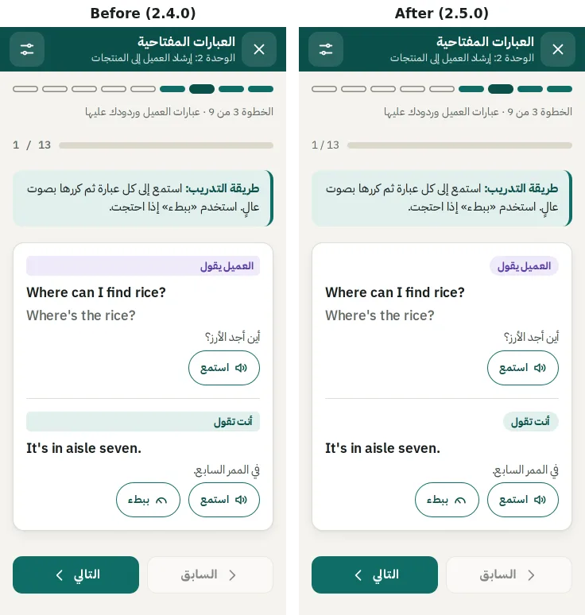
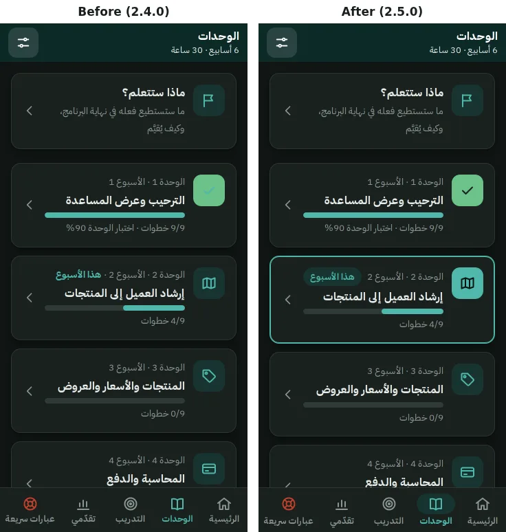
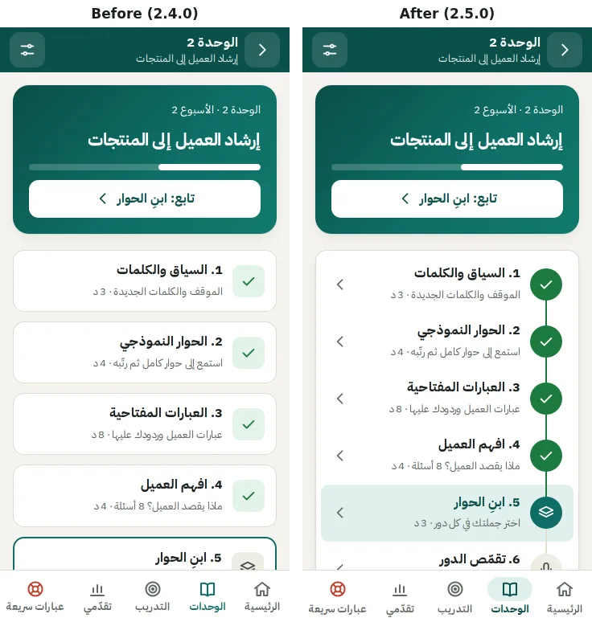
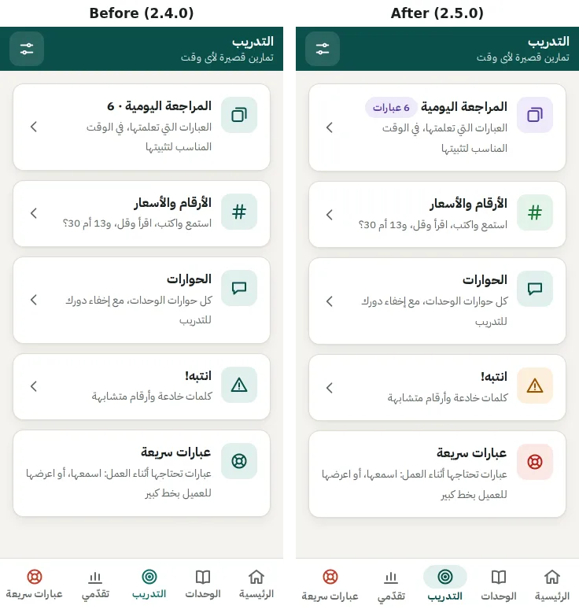
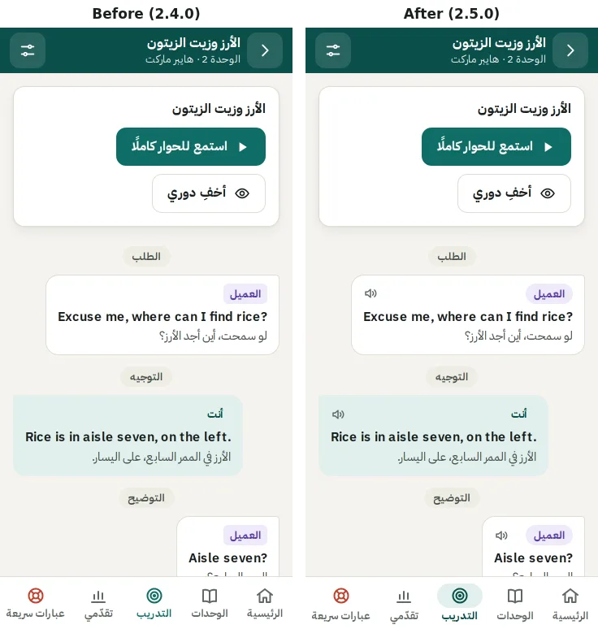
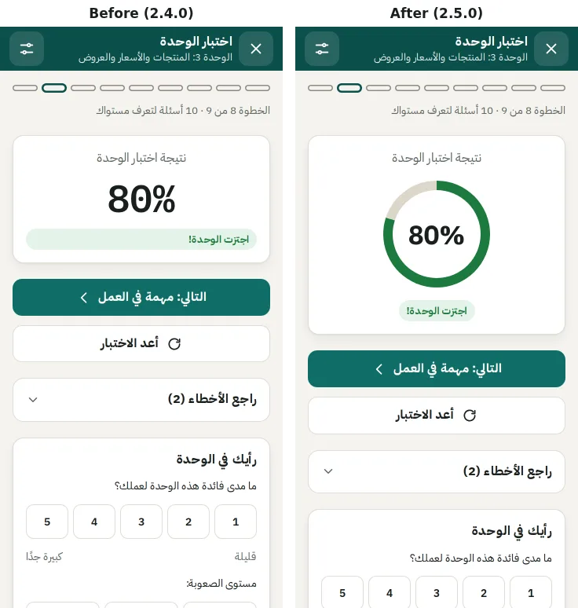

# Retail English: UI review

October 2026 · app version 2.4.0 (commit `4fb0552`), changes shipped in 2.5.0.

**Status:** all 14 findings are fixed in 2.5.0. Each section ends with what changed. Two items remain open; see the end of this document.

This review follows the [UX and UI evaluation](ux-ui-evaluation.md). That review dealt with flows: what learners can reach, where they get stuck and what they might lose. This one looks at the visual layer: hierarchy, colour, type, icons and states, in light and dark mode.

## How the app was reviewed

- I captured the main screens at 360×740 CSS px in light and dark mode, for a learner in week 2 with seeded progress. The screens were Home, Units, a unit page, Practice, Progress, the phrases step, a dialogue, a unit check result, daily review and Settings.
- I measured computed styles in headless Chromium where a screenshot looked wrong. One example: the step list's chevrons, which turned out to be drawn at 0×0 px.
- I re-ran the full walkthrough afterwards: 66 screens, including 320 px and the trainer pages. It runs axe-core and the layout checks. It now also flags any icon drawn at less than 8 px or more than 64 px.

## Verdict

The app was consistent but flat. Almost every screen was a stack of identical white cards with the same teal icon tile. So the screens told the learner little about state: what is done, what is next, what is this week. The second problem was dark mode, where a few colours were tuned for light mode only.

None of the fixes change the layout model or the content.

## Bugs

### 1. Step rows had no chevron

On the unit page, each step row has a chevron. It was drawn at 0×0 px, because the icon had no CSS size there and SVG icons had no fallback size.

**Fixed:** every icon now carries a 24 px fallback size, and the step chevrons are sized like the other cards' (20 px). The walkthrough checks icon sizes on every screen.

### 2. Speaker labels stretched across the card

In the phrases step, «العميل يقول» and «أنت تقول» filled the full width of the card as tinted bars, instead of sitting as labels.

**Fixed:** speaker labels are now rounded chips sized to their text, like the app's other chips.

### 3. Low contrast in dark mode

- **Passed-unit badge.** The badge drew a teal check on light green. A dark-mode rule that recoloured all badges outranked the "done" style.
- **Buttons on light red and violet.** «مسح كل البيانات» and the microphone button drew white on dark mode's light red and light violet. That is about 2.2:1 to 2.4:1.

**Fixed:**

- These now use the page's surface colour for text and icons. That is white in light mode, as before, and near-black in dark mode, where contrast is now about 7:1.
- A new `--brand-text` colour token replaces five per-component dark-mode overrides, the source of the badge bug.

### 4. Result pills stretched across the card

«تحتاج 80% لاجتياز الوحدة», «أفضل نتيجة» and similar pills filled the full card width.

**Fixed:** a pill in a stack is sized to its text and centred in centred cards.

### 5. "8 د" could wrap apart

At 320 px, a step's time could break so that «د» starts the next line on its own.

**Fixed:** the number and its unit are joined by a non-breaking space.

## Hierarchy and state

### 6. The unit page did not show the path

The nine steps were nine separate cards. Done steps differed only by a pale green tile, and the next step only by a border. The list was long, and it did not read as a sequence. Screen readers got no done or next state at all.

**Fixed:**

- The steps are one card, joined by a line through their icons.
- Done steps are solid green, with the line in green up to the next step. The next step is tinted in the brand colour.
- The list is 127 px shorter on a 360 px phone.
- Screen readers now hear «أنجزتها» or «الخطوة التالية» after a step's name.

### 7. This week's unit was hard to spot

On the Units list, the only marker was small green text, «هذا الأسبوع», at the end of the meta line.

**Fixed:** the current unit has a brand-coloured border, a filled icon tile and a «هذا الأسبوع» pill.

### 8. Every tile looked the same

Practice and Home used the same teal tile for every destination. The review count was appended to a title as «· 6».

**Fixed:** tiles are tinted by kind, and the review tile shows its count as a pill, for example «6 عبارات».

| Tile | Tint |
|---|---|
| Daily review | Violet |
| Numbers and prices | Green |
| Dialogues | Teal |
| Watch out | Amber |
| Mission | Amber |
| Quick phrases | Red, matching the lifebuoy in the tab bar |

Also, the new learner's «أو ابدأ الوحدة 1 مباشرة» card had used the info icon. It now shows the unit's icon.

### 9. The current tab was shown by colour alone

**Fixed:** the current tab's icon sits on a tinted pill and its label is bold, so the state no longer depends on telling grey from teal.

## Type and numbers

### 10. Numbers looked like code

Stats, counters («1 / 13», «0/6»), the listening test scores and the rating buttons used IBM Plex Mono.

**Fixed:** they use IBM Plex Sans with tabular figures, so columns still line up. The monospace face is kept where it means something: prices, the receipt and the price-entry field.

## Interaction cues

### 11. Dialogue bubbles did not look tappable

Every line of a dialogue plays when tapped, but nothing said so.

**Fixed:**

- Each bubble shows a speaker icon next to its label. A line hidden for practice shows an eye, which turns into a speaker once the line is shown.
- The bubble being played is outlined.

### 12. Results were a bare number

**Fixed:** a ring fills to the score: green for a pass, amber for not yet. It fills when the result opens, with no animation under reduced motion. The ring is used for:

- the unit check
- the "understand the customer" step
- the listening test

The speed round's count uses the same number face.

### 13. Quiz marks were drawn in black

**Fixed:** ✓ and ✗ on answered options are green and red, matching the option's border.

### 14. Cards gave no feedback on touch

Link cards only reacted to hover, which phones do not have.

**Fixed:** on touch screens they tint while pressed.

## Results after the changes

- **axe-core:** 0 violations on 66 screens, in light and dark mode, at 320 px, and on the trainer pages.
- **Layout:**
  - no horizontal overflow, and no text under 13 px
  - no touch target under 44 px, apart from the visually hidden skip link, which appears only on keyboard focus
  - no icon drawn at 0 px or blown up
- **Behaviour suites:** all 37 and 46 checks pass.
- **Thumb test:** no forced scrolls at 360×640, 360×740 or 412×915.
- **ESLint:** no errors, and the same warnings as 2.4.0.

## Still open

- **The unit check at 320×568.** On very small phones (iPhone SE, first generation), the last answer of 3 of unit 3's 10 check items is below the fold, so the learner scrolls once to reach it. 2.4.0 behaves the same.
- **Real devices.** The ring's fill animation needs `@property`, which is in Safari 16.4 and later. Older Safari skips the fill and shows the final ring after about half a second. Check this on real phones before the pilot, along with the pressed state of cards and the dark-mode colours.
