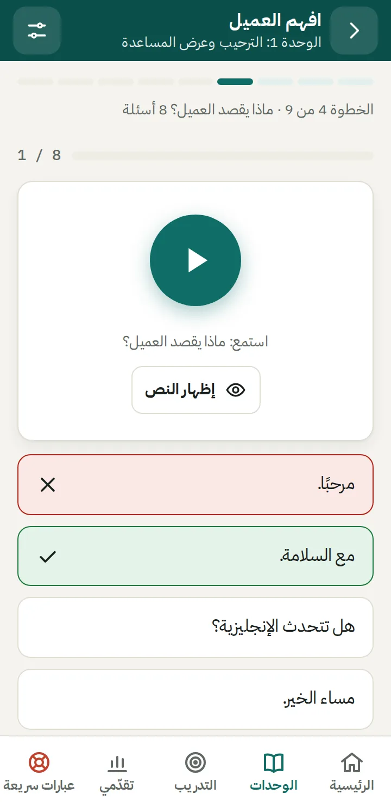
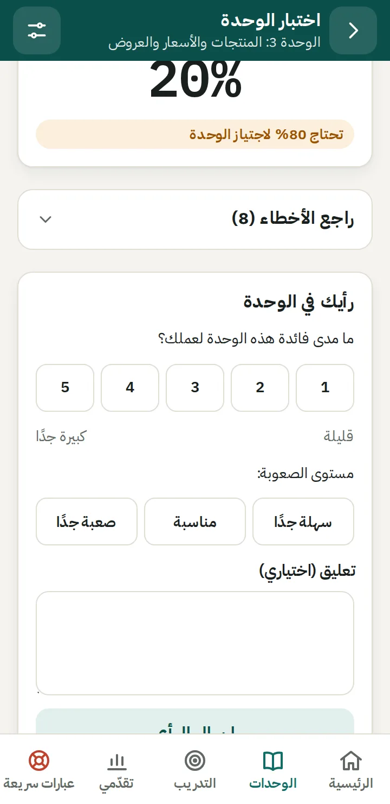
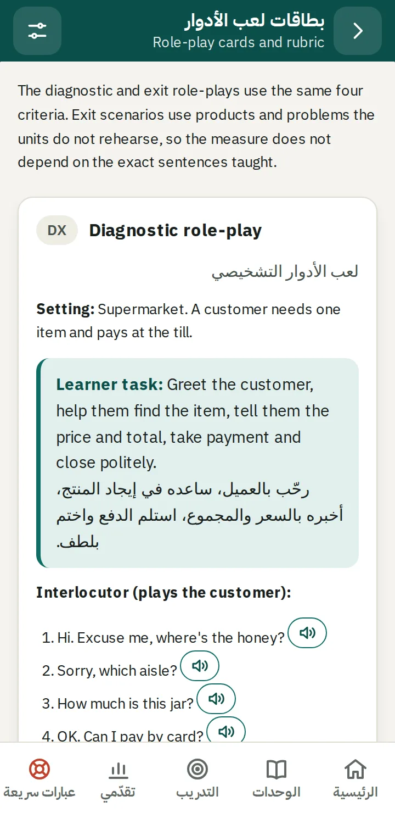
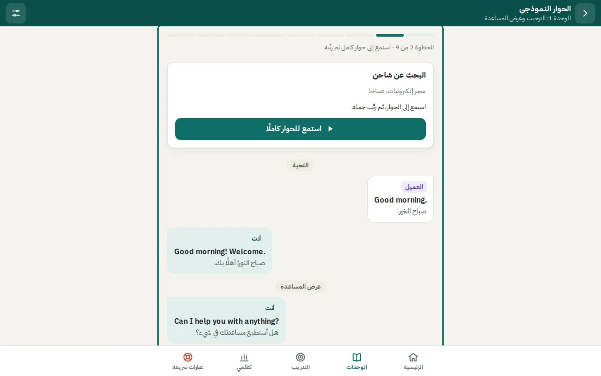
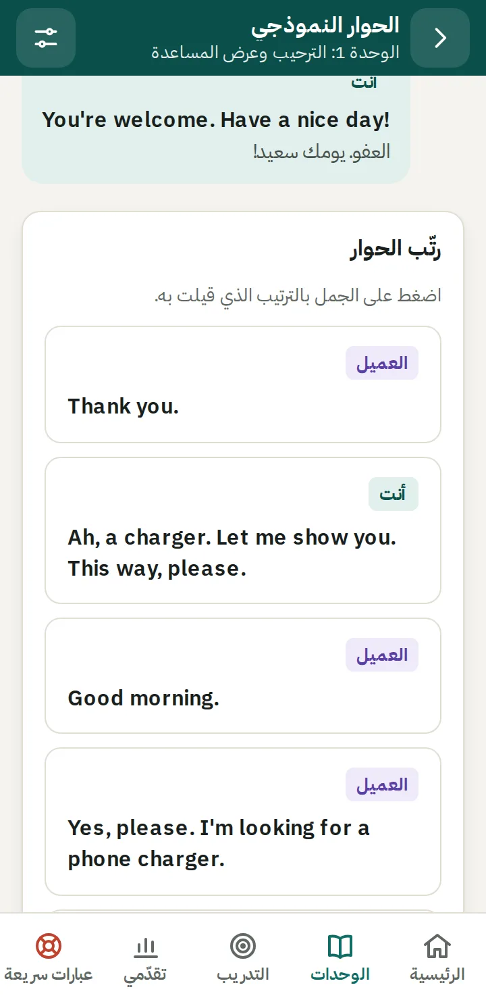
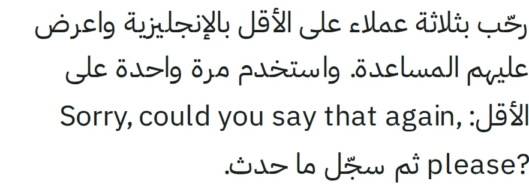
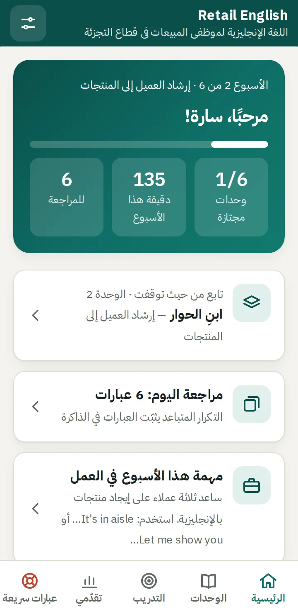

# Retail English: UX and UI evaluation

October 2026 · app version 2.2.0 (commit `75fc789`). Line numbers refer to that commit.

**Status:** all 15 findings are fixed: 1–5 in version 2.3.0 and 6–15 in version 2.4.0. Each section ends with what changed. The recorded-audio suggestion under "Beyond the interface" is still open.

A follow-up review of the visual layer, fixed in 2.5.0, is in [ui-review.md](ui-review.md).

After the fixes, axe-core reports no violations on 66 screens. That includes the trainer pages, scanned after unlocking. No screen has horizontal overflow, touch targets under 44 px or text under 13 px.

## How the app was evaluated

- I read `index.html`, `css/app.css` and `js/app.js` in full, and reviewed how the content in `js/program.js` is structured.
- I ran the app in headless Chromium and went through every learner and trainer screen at 360×740 CSS px. I did this in light and dark mode, once as a new learner and once as a learner in week 2 with seeded progress. I also spot-checked 320×568, 360×640, 393×852, 412×915 and 1280×800.
- I ran axe-core 4 (WCAG 2.1 AA and best-practice rules) on 60 screens. Scripts also checked for horizontal overflow, touch targets under 44 px and text under 13 px.
- To simulate thumb use, a script worked through three activities. It tapped only what was on screen, scrolled by hand when a target was hidden, and counted those scrolls.
- For speech, the main pass simulated three English voices. I tested the "no English voice" path with Chromium's real speech engine, which has no voices. I did not test speech recognition.

## Verdict

The foundation is good. The Arabic-first layout is careful, units have a clear and predictable structure, the visual language is consistent, and automated checks are mostly clean. The problems that matter most are in three areas:

1. **The quiz loop on ordinary phones.** On 360 px-wide screens, almost every answer needs a scroll before the learner can see the feedback and reach **التالي**.
2. **Data durability.** All progress lives in browser storage, which iPhones clear after a week without a visit.
3. **The trainer area.** Learners can open it, and it shows the exit role-play scripts.

Most of the fixes are small.

## What works well

- **RTL done right.** English is isolated with `dir="ltr"` and `<bdi>`. Chevrons and the toggle switch mirror correctly. IBM Plex Sans Arabic and Plex Sans pair well.
- **A predictable unit structure.** Each unit has nine steps, and each step has a one-line purpose and a time estimate. The unit page has a start/continue button and highlights the current step.
- **Immediate feedback.** Every answer shows the correct answer, its English text and its Arabic meaning.
- **Clean automated results:**
  - no horizontal overflow at any width down to 320 px
  - no axe contrast failures in light or dark mode
  - every learner touch target is at least 44 px
- **A helpful no-voice path.** It explains how to install an English voice on Android and iPhone instead of failing silently.
- **Platform support:** dark mode, reduced motion and offline use.

## Findings

| # | Priority | Finding | Effort | Status |
|---|---|---|---|---|
| 1 | High | Quiz feedback and **التالي** fall below the fold on common phones | S | Fixed in 2.3.0 |
| 2 | High | Unit-check results open half-scrolled, and a learner who failed sees a survey before any way to recover | S | Fixed in 2.3.0 |
| 3 | High | Progress can silently disappear, because it is kept only in browser storage | M | Fixed in 2.3.0 |
| 4 | High | Learners can open the trainer area, including the exit role-play scripts | S–M | Fixed in 2.3.0 (code gate) |
| 5 | Medium | A teal outline frames the whole screen on first open and during keyboard use | XS | Fixed in 2.3.0 |
| 6 | Medium | The app never asks for the learner's name, so the shared record says "—" | S | Fixed in 2.4.0 |
| 7 | Medium | Learners can copy the dialogue-ordering task from the transcript above it | S | Fixed in 2.4.0 |
| 8 | Medium | Lessons carry too much chrome, Back steps through history, and leaving a quiz discards it silently | M | Fixed in 2.4.0 |
| 9 | Medium | The step-progress strip barely shows which steps are done | XS | Fixed in 2.4.0 |
| 10 | Medium | English sentences inside Arabic text break across lines | S | Fixed in 2.4.0 |
| 11 | Medium | Home doesn't highlight the next action or show the daily goal | S | Fixed in 2.4.0 |
| 12 | Medium | The listening check spends one of its two plays automatically and has no "don't know" option | S | Fixed in 2.4.0 |
| 13 | Low | Accessibility gaps found by axe | S | Fixed in 2.4.0 |
| 14 | Low | Arabic plural forms | XS | Fixed in 2.4.0 |
| 15 | Low | Smaller polish items | XS | Fixed in 2.4.0 |

### 1. Quiz feedback and التالي fall below the fold

**What happens.**

- After an answer, the feedback and the **التالي** button are added below the options (`js/app.js:1427-1430`).
- The button is focused with `preventScroll: true`, so the page does not scroll.
- A new question does not reset the scroll position either (`runQuiz`, `js/app.js:1358`).

**Evidence.** In the thumb simulation, these are the manual scrolls needed to finish each activity:

| Visible viewport | Understand the customer (8 items) | Unit check (10) | Key phrases (13) |
|---|---|---|---|
| 360×640 | 8 | 10 | 2 |
| 360×740 | 8 | 9 | 2 |
| 393×852 | 8 | 3 | 0 |
| 412×915 | 0 | 0 | 0 |

A 360×640 viewport is roughly what a 360×800 Android phone shows in Chrome while the address bar is visible. At that size, the top of the question card was also hidden under the app bar on 7 of 8 new questions.

**Fix.**

- **Quick fix:** after an answer, call `$('#qnext', host).scrollIntoView({ block: 'nearest', behavior: 'smooth' })`, and start each `draw()` with `window.scrollTo(0, 0)`. Do the same in `lcRunner`, `viewNumbers` and the review deck.
- **Better fix:** add an answer bar holding the feedback and **التالي** that slides up in place of the tab bar during activities (see #8).

**Status: fixed in 2.3.0.**

- Each question, phrase card, review card and results screen now starts at the top.
- After an answer, the page scrolls just far enough to show the feedback. The scroll clears the app bar, the tab bar and the new action bar.
- **التالي** and the other main buttons (phrase navigation, review grades, finishing the ordering task) sit in an action bar that stays just above the tab bar while the page scrolls.
- The build, role-play, ordering and numbers screens scroll each new turn, hint or answer into view.
- The question card is about 70 px shorter: a smaller play button, less padding, and the prompt and **إظهار النص** on one line. All four options now fit on a 360×640 screen.

The strict thumb test below taps the last option and checks that the whole feedback box is visible. It was run on the old and new code:

| Viewport | Forced scrolls, before → after | Answers with feedback hidden, before → after |
|---|---|---|
| 360×640 | 28 → 3 | 20 → 0 |
| 360×740 | 18 → 0 | 16 → 0 |
| 320×568 | 29 → 16 | 24 → 0 |

The counts cover Understand the customer, the unit check, key phrases and the review deck together. The three scrolls left at 360×640 are unit-check questions whose English answers wrap onto two lines, which pushes the fourth option below the fold.

### 2. Unit-check results open half-scrolled

**What happens.**

- `finish()` (`js/app.js:1728`) swaps in the results but keeps the quiz's scroll position, so the results open with the score cut off.
- Below the score come the mistakes and then the unit pulse survey.
- **أعد الاختبار** and **راجع العبارات** are at the very bottom, under the survey. A learner who just failed has to get past the feedback form before reaching any way to recover.

**Fix.**

1. Scroll to the top when the results appear.
2. Put the next action directly under the score: **التالي** after a pass, or **راجع العبارات** and **أعد الاختبار** after a fail.
3. Show the mistakes after that.
4. Make the pulse a short optional card at the end.

**Status: fixed in 2.3.0.** The results open at the top, in this order:

1. the score
2. the next action: **التالي** after a pass, or **راجع العبارات** (primary) and **أعد الاختبار** after a fail
3. the mistakes
4. the unit pulse

### 3. Progress can silently disappear

**What happens.** All progress is kept in `localStorage` (`js/app.js:281-292`), which causes four problems:

- **Safari on iPhone clears it.** Safari deletes a site's stored data after seven days of Safari use without a visit to that site. Apps added to the Home Screen are exempt. One missed week in a six-week program can erase everything, and the app never suggests installing it on iPhone or Android.
- **Chrome can evict it.** The app never calls `navigator.storage.persist()`, so Chrome can evict the data when the device runs low on storage.
- **Save failures are silent.** `save()` swallows errors (`js/app.js:290`). If storage is full or blocked, the learner keeps working and the work is lost.
- **Export is hidden.** Export exists, but only in Settings.

**Fix.**

- Add an install card on Home and show it until the app runs installed (`display-mode: standalone`):
  - on Android, use the `beforeinstallprompt` event
  - on iPhone, show the Share › Add to Home Screen steps
- Call `navigator.storage.persist()` after the first completed step.
- Warn once when a save fails.
- Prompt weekly to send the learning record to the trainer. If the record includes the JSON export, it also works as a backup.

**Status: fixed in 2.3.0.**

- **Install card.** Home shows an install card until the app runs installed. Choosing **لاحقًا** hides it for three days.
  - **Android:** the card uses Chrome's install prompt when there is one, and otherwise shows the browser-menu steps. It sits under the next step.
  - **iPhone:** the card shows the Share › Add to Home Screen steps and comes first for new learners.
- **Moving progress on iPhone.** A Home Screen app on iPhone keeps its storage separate from Safari, so it starts without the learner's progress. Learners who already have progress tap **انسخ تقدّمي** in the browser, then **الصق تقدّمي** on the installed app's Home. Pasting falls back to a paste box when clipboard access isn't available.
- **Persistent storage.** `navigator.storage.persist()` is requested once there is progress.
- **Save failures.** A failed save opens a one-time warning with a backup button.
- **Weekly reminder.** Home reminds learners once a week to send their learning record. Where the phone can share files, **مشاركة** attaches a backup file as `.txt`, because Chrome won't share `.json` files. **Settings › استيراد** accepts both formats. Exporting or sharing a backup resets the reminder.

### 4. Learners can open the trainer area

**What happens.**

- Settings › **للمدربين وفريق البرنامج** (`js/app.js:2339`) is open to everyone.
- **بطاقات لعب الأدوار** shows the three exit role-plays (X1–X3), with every customer line and a play button for each (`js/app.js:2583-2606`).
- The README says the exit role-plays use material that isn't rehearsed in the units. Today, any learner can rehearse them word for word.
- Learners can also add role-play ratings and alignment reviews.

**Fix.** Remove the link from learner Settings and put the trainer area behind a code, even a fixed one shared at the trainer briefing. A code in a static app only stops casual browsing, so the sturdier fix is to keep the X1–X3 scripts out of the learner app entirely, for example on a trainer-only page.

**Status: fixed in 2.3.0 with a code gate.**

- Every trainer page now asks for `meta.trainerCode` in `js/program.js`. The default is `7310`; change it before the pilot.
- Settings shows a small **للمدربين** link instead of a card that lists the trainer tools.
- A device stays unlocked until the trainer taps **أغلق صفحات المدربين على هذا الجهاز**.

The scripts and the exit listening-check items are still in the JavaScript source, so someone who reads the code can find them. Keeping them out of reach entirely would need a separate trainer-only file or a server.

### 5. A teal outline frames the whole screen

**What happens.** After each render, the app focuses `<main tabindex="-1">` (`js/app.js:887`). The global `:focus-visible` rule (`css/app.css:111`) then draws a 3 px teal outline around the whole content area. Chrome treats focus as visible on first load and after keyboard use. As a result, learners see this frame whenever they open or reload the app, and keyboard users see it on every screen.

**Fix.** Add `#view:focus { outline: none; }`. The main region is a programmatic focus target, not a control.

**Status: fixed in 2.3.0.**

- The outline on the main region is gone.
- `scroll-padding` on the page keeps keyboard-focused elements clear of the app bar and the tab bar.

### 6. The app never asks for the learner's name

**What happens.** The name and store fields exist only in Settings (`js/app.js:2319`). The learning record, which learners are told to show their trainer, therefore prints **المتدرب —** (`js/app.js:2202`). So does the shared text (`js/app.js:2174`).

**Status: fixed in 2.4.0.**

- **Home.** The welcome card asks new learners for their name, with a short note on why. The field is optional, and it goes away once a name is saved or the learner starts.
- **Learning record.** The record page asks for the name when it is missing. Tapping **مشاركة** without a name points to the field once; a second tap shares anyway.

### 7. The ordering task can be copied

**What happens.** In step 2, the full transcript, in English and Arabic, stays on screen directly above **رتّب الحوار** (`js/app.js:1254-1275`). Learners can scroll up and copy the order, so the task doesn't test listening. The page is also about 3.4 screens long at 360 px.

**Status: fixed in 2.4.0.** The step now has three stages:

1. **Study.** The learner reads and hears the dialogue first.
2. **Ordering.** **جاهز؟ رتّب الحوار** starts the ordering task. The transcript is hidden, but **استمع للحوار كاملًا** still plays it.
3. **Review.** Once the order is right, the full transcript comes back as a folded **نص الحوار كاملًا** section.

### 8. Lesson chrome and navigation

**What happens.**

- **Little space for the activity.** Inside a step, 166–265 px of app bar, step strip, step line and item counter sit above the activity, with the 64 px tab bar below it. On a 640 px-tall viewport that leaves about 310–410 px for the activity.
- **Back steps through history.** The back arrow returns through every step visited (`goBack`, `js/app.js:889`), not up to the unit page.
- **No warning on exit.** Leaving partway through, by back or by a tab, discards a half-done unit check, role-play or speed round without warning.

**Fix.** Add a focused lesson mode:

- hide the tab bar inside `unit/:u/:step`
- replace the back arrow with **×**, which returns to the unit page
- ask for confirmation before discarding an activity in progress

**Status: fixed in 2.4.0.**

- **Lesson mode.** Unit steps hide the tab bar, and the header button becomes **×** (**إغلاق الدرس**). It goes straight back to the unit page, skipping the steps visited on the way.
- **Leave confirmation.** Leaving a unit check, the "understand the customer" quiz, a role-play, the build or ordering task, the speed round or the listening check part-way now asks first. This covers the phone's back button, links, tabs and ×. If the learner stays, the activity keeps its state.
- **Effect.** With the extra space, the strict thumb test needs no forced scrolls at 360×640, down from 3 in version 2.3.0.

### 9. The step strip barely shows progress

**What happens.** The strip colours each step by its position, not by whether it is complete (`js/app.js:1183-1185`). Steps already passed use `#e1f0ed` and steps still ahead use `#eeece4`. These two colours have a contrast ratio of 1.01:1, and each has 1.07:1 against the page background, so they look the same. WCAG 1.4.11 asks for 3:1 for graphics that carry meaning. All progress bars use the same faint track.

**Fix.**

- Colour each step by completion:
  - **done:** `--brand`
  - **current:** outlined
  - **to do:** a darker grey
- Darken the track.

**Status: fixed in 2.4.0.**

- **Completion.** The strip now shows completion, not position:
  - done steps are filled
  - steps still to do are outlined in a grey with 3:1 contrast against the page
  - the current step is taller
- **Text alternative.** The strip has `role="img"` and a label such as "الخطوة 3 من 9، أنجزت 2 من 9".
- **Track.** Progress-bar tracks use a darker `--track` colour.

### 10. English sentences inside Arabic text break across lines

**What happens.**

- **Missions.** Three missions place whole English sentences inside Arabic text (`js/program.js:409`, `505`, `790`). When a sentence wraps, its first half sits at the left end of one line and its second half at the right end of the next. The README's own content rule says to keep English sentences out of Arabic text.
- **Home previews.** `preview()` strips the backticks (`js/app.js:690`), which removes the direction isolation, so the ellipsis lands on the wrong side ("…Let me show you").
- **Trainer hub.** The titles break the same way: "Role-" ends one line and "play cards" starts the next (`js/app.js:2419-2425`).

**Fix.**

- Move the sentences into a list shown as tap-to-hear lines, like the Watch-out items.
- Give each mission a short Arabic-only summary for Home.
- Put the English trainer titles on their own line.

**Status: fixed in 2.4.0.**

- **Missions.** The three missions keep their English lines in a new `items` list, shown as tap-to-hear lines with the Arabic meaning below. Their Arabic text no longer contains English.
- **Home.** Every mission has a short Arabic-only `short` summary, which Home shows.
- **Trainer hub.** The English titles sit on their own line.

### 11. Home doesn't highlight the next action

**What happens.**

- Every Home card has the same visual weight, so **تابع من حيث توقفت** looks no different from the review and mission cards beside it.
- Unlike the unit page, the Home hero has no button.
- The program asks for about 20 minutes a day, but Home only shows **دقيقة هذا الأسبوع**, with no target. The target appears only on the Progress tab.

**Fix.**

- Add a **تابع** button to the hero, as on the unit page.
- Show progress against the target, either "اليوم: 12 / 20 دقيقة" or this week's minutes against 120.

**Status: fixed in 2.4.0.**

- **Next-action button.** The welcome card ends with a button for the one next thing to do: the entry listening check for a new learner, then **تابع: <step>**, then the final assessment. That step is no longer repeated as a card.
- **New learners.** They also get a smaller **أو ابدأ الوحدة 1 مباشرة** card.
- **Daily goal.** The stats show today's minutes against the daily goal, for example 12/20. The goal is `meta.dailyMinutes`, default 20.

### 12. The listening check plays automatically and has no "don't know" option

**What happens.**

- Each item plays as soon as it appears, and that play counts as one of the two allowed (`js/app.js:1012-1019`).
- The first item therefore opens with **يمكنك الاستماع مرة أخرى**. A learner who wasn't ready gets only one real listen.
- Price items can't be skipped (`js/app.js:1004`). A learner who heard nothing has to make up a number, which adds noise to a diagnostic.

**Fix.**

- Don't auto-play in the check, or don't count the automatic play.
- Add a **لا أعرف** option.

**Status: fixed in 2.4.0.**

- **No automatic play.** Each item waits for the learner to press play, and both plays are theirs.
- **Don't know.** **لا أعرف** records an unanswered item, with `ans: null`, instead of a guess.
- **Intro.** The check's intro explains both rules.

### 13. Accessibility gaps found by axe

| Issue | Where | Fix |
|---|---|---|
| No screen has an `<h1>`; the screen title is a `
` | `index.html:23` | Make `#barTitle` an `h1` |
| Progress bars have no accessible name (86 instances on 27 screens) | `js/app.js:703` | Add an `aria-label` |
| `.step-progress` puts `aria-label` on a plain `div` | `js/app.js:1183` | Add `role="img"`, or make it a progress bar |
| The 21 audio buttons on the trainer role-play cards have no text label and are 36×28 px | `js/app.js:2598` | Add labels and enlarge them |
| `.table-scroll` regions can't be reached by keyboard | `css/app.css:551` (class) | Add `tabindex="0"` and a label |
| The bottom sheet doesn't keep focus inside while open | `js/app.js:543` | Trap focus in the sheet |

**Status: fixed in 2.4.0.** All six issues in the table are fixed:

- the screen title is an `h1`, and top-level card titles are `h2`
- every progress bar has a name
- the step strip has `role="img"` with a label
- the trainer play buttons are labelled and 44 px
- scrollable tables are focusable regions with names
- the sheet makes the page behind it `inert` and keeps Tab inside

### 14. Arabic plural forms

Counts above one always use the same plural form, which is often wrong:

| Shown | Correct |
|---|---|
| 2 عبارات | عبارتان |
| 15 عبارات | 15 عبارة |
| (2 محاولتان) | (محاولتان) |
| 9 يومًا | 9 أيام |

These strings are at `js/app.js:940`, `1994`, `2148` and `2214`. `Intl.PluralRules('ar')` returns the right category for each count (zero, one, two, few, many or other).

**Status: fixed in 2.4.0.**

- A `countAr()` helper uses `Intl.PluralRules('ar')`.
- Each word has a nominative and a genitive dual where the case needs one. For example, «مراجعة اليوم: عبارتان» but «أنهيت مراجعة عبارتين».

### 15. Smaller polish items

- **Naming:** quick phrases goes by three names, **عبارات سريعة** on the tab and the sheet, and **مساعدة سريعة** and **عبارات الطوارئ** on the Practice tile (`js/app.js:1833-1836`).
- **Showing phrases to customers:** the quick-phrases sheet says **اعرضها للعميل**, but there is no large-text view for turning the phone toward a customer. A tap-to-enlarge, full-screen phrase would make that work.
- **Numbers subtitle:** the header subtitle stays **اسمع السعر واكتبه** in all three modes (`js/app.js:1841`).
- **Review deck:** **سهلة** is the only filled button, which nudges learners to grade themselves "easy" (`js/app.js:2017-2021`). Give the three grades equal weight.
- **Sticky hover:** hover borders stay on after a tap on touch screens (`css/app.css:185`, `240`, `333`, `373`, `422`, `529`). Wrap the hover rules in `@media (hover: hover)`.
- **Tab labels:** they are 12.5 px, the only text under 13 px (`css/app.css:159`), and **عبارات سريعة** wraps onto two lines at 320 px.

**Status: fixed in 2.4.0.**

- **Naming.** The feature is called **عبارات سريعة** everywhere.
- **Large type.** Each quick phrase has a large-type button that shows it full screen for a customer. Escape or **إغلاق** returns to the sheet.
- **Numbers subtitle.** The subtitle follows the selected mode.
- **Review grades.** The three grades look the same.
- **Hover.** All hover styles are inside `@media (hover: hover)`.
- **Tab labels.** They are 13 px, and the quick-phrases tab is a little wider, so its label stays on one line down to 320 px.

## Beyond the interface

The entry and exit listening checks use the phone's speech voices. The same test therefore sounds different from phone to phone, and some phones play nothing at all. Since the check is a pre/post measure, recording audio for its 20 items would make scores comparable across learners.

## Suggested order

The fixes are all in place, so this is the order they were planned in.

1. **Quick fixes:** #5, #1 (quick version), #2, #9 and #14.
2. **Before the pilot:** #3, #4, #6 and #12.
3. **Next iteration:** #8 (lesson mode), #7, #10, #11, #13 and #15.
